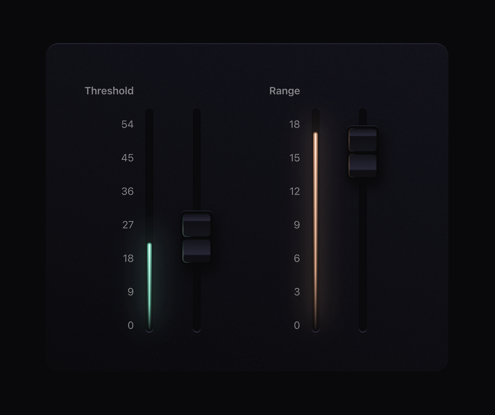

# Soundboard Sliders

I saw [this post](https://x.com/designloomco/status/1795730251995345224) by @designloomco on Twitter where he had asked his developer to make a real-time reflection on some audio sliders as they move past the lights on a soundboard. I immediately knew I wanted to try it!

This gave me a chance to try some new techniques I'd heard of but hadn't played with yet, one of them being the use of an offset-path to create an animated border ([here's a nice explanation I found on that technique](https://x.com/jh3yy/status/1752903535488823789) by @jh3yy). I'm also fairly new to using Framer Motion and have been taking Emil Kowalski's course on it (@emilkowalski\_). This project gave me an opportunity to solidify some of what I've been learning there.

Had a lot of fun and love how it turned out:

<video controls src="soundboard-sliders.mp4"></video>

